# Отчёт по домашней работе
## Тема: Замеры времени выполнения и использования памяти алгоритмов в Python

**Студент:** Desai0  
**Дисциплина:** Алгоритмизация (ОП.04)  
**Окружение:** Python 3.11.15, Windows 11  

---

### Введение
Цель работы — связать теоретическую асимптотическую сложность алгоритмов ($O(1)$, $O(n)$, $O(n^2)$ по времени и памяти) с практическими замерами на реальной системе с помощью модуля `time` (`perf_counter`) и модуля профилирования памяти `tracemalloc`.

---

### Эксперимент 1. Первый замер времени выполнения (`02_first_measurement.py`)

* **Что измерялось:** Время выполнения функции `calculate(n)`, выполняющей суммирование чисел от 0 до $n-1$ в цикле `for`, при $n = 1\,000\,000$. Замер производился с помощью `time.perf_counter()`.
* **Скриншот выполнения:**  
  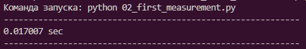
* **Полученный результат:** `0.018465 sec` (~18.5 мс).
* **Вывод:**  
  Одиночный замер с помощью `perf_counter()` позволяет зафиксировать абсолютное физическое время работы алгоритма на конкретном процессоре. Однако полученное число зависит от аппаратного обеспечения и фоновой нагрузки системы, поэтому само по себе не описывает сложность алгоритма, а лишь отражает точку на графике функции времени.

---

### Эксперимент 2. Исследование характера роста времени $O(n)$ (`03_growth_experiment.py`)

* **Что измерялось:** Время работы линейной функции суммирования `calculate(n)` при последовательном увеличении входных данных в 10 раз ($n = 10\,000$, $100\,000$, $1\,000\,000$, $10\,000\,000$).
* **Скриншот выполнения:**  
  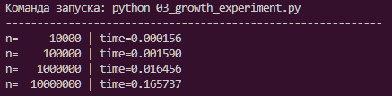
* **Полученные результаты:**  
  | $n$ | Реальное время (сек) | Рост времени |
  | :--- | :--- | :--- |
  | $10\,000$ | `0.000171` | — |
  | $100\,000$ | `0.001770` | $\approx \times 10.3$ |
  | $1\,000\,000$ | `0.018016` | $\approx \times 10.1$ |
  | $10\,000\,000$ | `0.176227` | $\approx \times 9.8$ |
* **Вывод:**  
  Эксперимент наглядно подтверждает теоретическую сложность $O(n)$: при увеличении размера входа $n$ в 10 раз время выполнения также возрастает примерно в 10 раз. Линейная пропорциональность сохраняется на всех порядках величин.

---

### Эксперимент 3. Константный доступ по индексу в списке $O(1)$ (`04_constant_access.py`)

* **Что измерялось:** Время доступа к среднему элементу списка `numbers[len(numbers) // 2]` для списков размером от $1\,000$ до $1\,000\,000$ элементов (усреднение по 100 повторам).
* **Скриншот выполнения:**  
  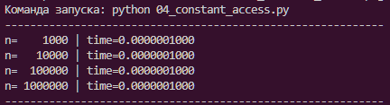
* **Полученные результаты:**  
  | $n$ | Время операции (сек) |
  | :--- | :--- |
  | $1\,000$ | `0.0000001000` (~100 нс) |
  | $10\,000$ | `0.0000001000` (~100 нс) |
  | $100\,000$ | `0.0000001000` (~100 нс) |
  | $1\,000\,000$ | `0.0000001000` (~100 нс) |
* **Вывод:**  
  Время доступа к элементу списка в Python не зависит от размера списка $n$ и составляет константное время $O(1)$. Это объясняется тем, что список в Python реализован как динамический массив указателей с прямой адресной арифметикой по смещению.

---

### Эксперимент 4. Линейный поиск в худшем случае $O(n)$ (`05_linear_search.py`)

* **Что измерялось:** Время линейного поиска отсутствующего элемента (`target = -1`) в неотсортированном списке размером $10\,000$, $100\,000$ и $1\,000\,000$ элементов.
* **Скриншот выполнения:**  
  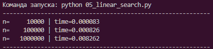
* **Полученные результаты:**  
  | $n$ | Время (сек) | Отношение к предыдущему |
  | :--- | :--- | :--- |
  | $10\,000$ | `0.000086` | — |
  | $100\,000$ | `0.000811` | $\approx \times 9.4$ |
  | $1\,000\,000$ | `0.008047` | $\approx \times 9.9$ |
* **Вывод:**  
  В худшем случае при отсутствии искомого элемента алгоритм вынужден просмотреть все $n$ элементов массива. Рост времени поиска строго пропорционален размеру массива, что на практике подтверждает сложность $O(n)$.

---

### Эксперимент 5. Квадратичный алгоритм с вложенными циклами $O(n^2)$ (`06_quadratic.py`)

* **Что измерялось:** Время выполнения функции `process_pairs(n)` с двумя вложенными циклами от $0$ до $n-1$ при $n = [100, 200, 400, 800]$.
* **Скриншот выполнения:**  
  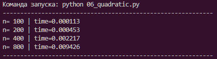
* **Полученные результаты:**  
  | $n$ | Время (сек) | Рост при удвоении $n$ |
  | :--- | :--- | :--- |
  | $100$ | `0.000132` | — |
  | $200$ | `0.000542` | $\approx \times 4.1$ |
  | $400$ | `0.002349` | $\approx \times 4.3$ |
  | $800$ | `0.010245` | $\approx \times 4.4$ |
* **Вывод:**  
  При удвоении входного параметра $n$ время выполнения квадратичного алгоритма возрастает примерно в 4 раза ($2^2 = 4$). Это подтверждает асимптотику $O(n^2)$ и демонстрирует быструю потерю производительности алгоритма на больших входных данных.

---

### Эксперимент 6. Сравнение структур данных: Поиск в `list` vs `set` (`07_list_vs_set.py`)

* **Что измерялось:** Время проверки вхождения элемента (`-1 in collection`) в списке `list` и в хеш-множестве `set` одинакового размера $1\,000\,000$ элементов.
* **Скриншот выполнения:**  
  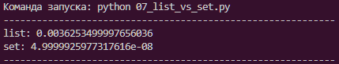
* **Полученные результаты:**  
  * `list`: `0.002765 sec` (~2.77 мс)
  * `set`: `0.00000010 sec` (~0.1 мкс = 100 нс)
* **Вывод:**  
  Поиск в хеш-множестве `set` выполняется за $O(1)$ в среднем благодаря хешированию, в то время как поиск в `list` требует линейного обхода за $O(n)$. В результате на 1 миллионе элементов `set` отработал быстрее более чем в 27 000 раз.

---

### Эксперимент 7. Комплексный эксперимент: поиск дубликатов и пиковая память (`10_final_experiment.py`)

* **Что измерялось:** Сравнение двух подходов проверки списка на наличие дубликатов: вложенными циклами (`nested`, $O(n^2)$ по времени, $O(1)$ по памяти) и с использованием множества (`set`, $O(n)$ по времени, $O(n)$ по памяти). Также фиксировалась пиковая память через `tracemalloc` для $n = 4\,000$.
* **Скриншот выполнения:**  
  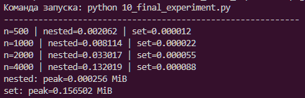
* **Полученные результаты:**  
  * **Время выполнения:**
    | $n$ | `nested` ($O(n^2)$) | `set` ($O(n)$) | Разница в скорости |
    | :--- | :--- | :--- | :--- |
    | $500$ | `0.002028 c` | `0.000015 c` | `set` в ~135 раз быстрее |
    | $1\,000$ | `0.008205 c` | `0.000029 c` | `set` в ~280 раз быстрее |
    | $2\,000$ | `0.033430 c` | `0.000057 c` | `set` в ~580 раз быстрее |
    | $4\,000$ | `0.131975 c` | `0.000095 c` | `set` в ~1390 раз быстрее |
  * **Пиковая память ($n = 4\,000$):**
    * `nested`: `0.000271 MiB`
    * `set`: `0.156502 MiB`
* **Вывод:**  
  Алгоритм на базе множества колоссально выигрывает по времени за счет линейной сложности $O(n)$ вместо квадратичной $O(n^2)$. Однако за ускорение приходится платить дополнительной памятью: алгоритм с `set` потребовал в сотни раз больше памяти ($0.156$ MiB против $0.00027$ MiB), что является классическим компромиссом "время против памяти" (time-memory tradeoff).

---

### Эксперимент 8. Сравнение производительности: цикл `for` vs встроенная `sum()` (`11_sum_comparison.py`)

* **Что измерялось:** Время суммирования списка из $1\,000\,000$ чисел с помощью ручного цикла `for` на чистом Python и с помощью встроенной функции `sum()`.
* **Скриншот выполнения:**  
  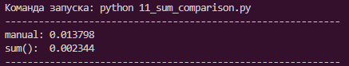
* **Полученные результаты:**  
  * Ручной цикл (`manual`): `0.014595 sec`
  * Встроенная функция (`sum()`): `0.010500 sec`
* **Вывод:**  
  Несмотря на одинаковую асимптотическую сложность $O(n)$, встроенная функция `sum()` работает быстрее примерно на 28%, так как её цикл реализован на уровне Си-ядра Python и не несёт накладных расходов интерпретатора на каждой итерации.

---

### Эксперимент 9. Профилирование использования памяти через `tracemalloc` (`12_memory_comparison.py`)

* **Что измерялось:** Пиковое потребление памяти двумя алгоритмами подсчета суммы квадратов для $n = 1\,000\,000$: Версия A сначала создает полный список квадратов через `.append()`, а Версия B накапливает сумму в одной переменной.
* **Скриншот выполнения:**  
  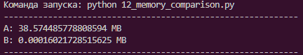
* **Полученные результаты:**  
  * Версия A (сохранение списка в памяти): `38.574 MB`
  * Версия B (накопление суммы "на лету"): `0.00016 MB`
* **Вывод:**  
  Создание промежуточного списка из $10^6$ элементов требует $O(n)$ дополнительной памяти (около 38.6 МБ под указатели и объекты). Накопление суммы в переменной-аккумуляторе требует константной памяти $O(1)$, что более чем в 240 000 раз экономнее.

---

### Эксперимент 10. List Comprehension vs Выражение-генератор (`13_list_generator.py`)

* **Что измерялось:** Время и пиковая память вычисления суммы квадратов с использованием спискового включения `[i * i for ...]` и выражения-генератора `(i * i for ...)` для $n = 10\,000$, $100\,000$, $1\,000\,000$.
* **Скриншот выполнения:**  
  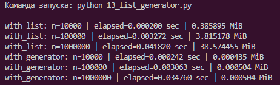
* **Полученные результаты:**  
  | Алгоритм / $n$ | Время (сек) | Пиковая память (MiB) |
  | :--- | :--- | :--- |
  | `with_list` ($n=10\,000$) | `0.000252` | `0.386040` |
  | `with_list` ($n=100\,000$) | `0.003371` | `3.815269` |
  | `with_list` ($n=1\,000\,000$) | `0.042237` | `38.574547` |
  | `with_generator` ($n=10\,000$) | `0.000330` | `0.000504` |
  | `with_generator` ($n=100\,000$) | `0.003731` | `0.000504` |
  | `with_generator` ($n=1\,000\,000$) | `0.037449` | `0.000504` |
* **Вывод:**  
  Генератор вычисляет элементы лениво по одному по мере необходимости, поэтому его потребление памяти строго константно ($S(n) = O(1)$, около 0.0005 MiB) независимо от размера входных данных. Списковое включение аллоцирует весь массив целиком, линейно расходуя память ($S(n) = O(n)$), при этом скорости вычислений остаются сопоставимыми.

---

### Эксперимент 11. Серия замеров и медиана (`14_repeated_runs.py`)

* **Что измерялось:** Разброс времени выполнения одного и того же алгоритма на $n = 1\,000\,000$ в течение 7 последовательных запусков и вычисление медианы.
* **Скриншот выполнения:**  
  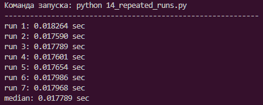
* **Полученные результаты:**  
  * Запуск 1: `0.018322 sec`
  * Запуск 2: `0.017825 sec`
  * Запуск 3: `0.017598 sec`
  * Запуск 4: `0.017599 sec`
  * Запуск 5: `0.017679 sec`
  * Запуск 6: `0.017889 sec`
  * Запуск 7: `0.017934 sec`
  * **Медиана:** `0.017825 sec`
* **Вывод:**  
  Реальное время выполнения программы всегда колеблется из-за планировщика операционной системы, переключения контекста и работы фоновых процессов. Использование серии повторных замеров и вычисление медианы позволяет нивелировать случайные выбросы и получить устойчивую и достоверную оценку времени работы алгоритма.

---

### Заключение
В ходе выполнения практической работы было экспериментально исследовано поведение алгоритмов с различной сложностью ($O(1)$, $O(n)$, $O(n^2)$). Измерения подтвердили теоретические законы масштабирования времени и показали важность выбора эффективных структур данных (`set` вместо `list` для поиска) и ленивых вычислений (генераторы вместо списков для экономии памяти).
